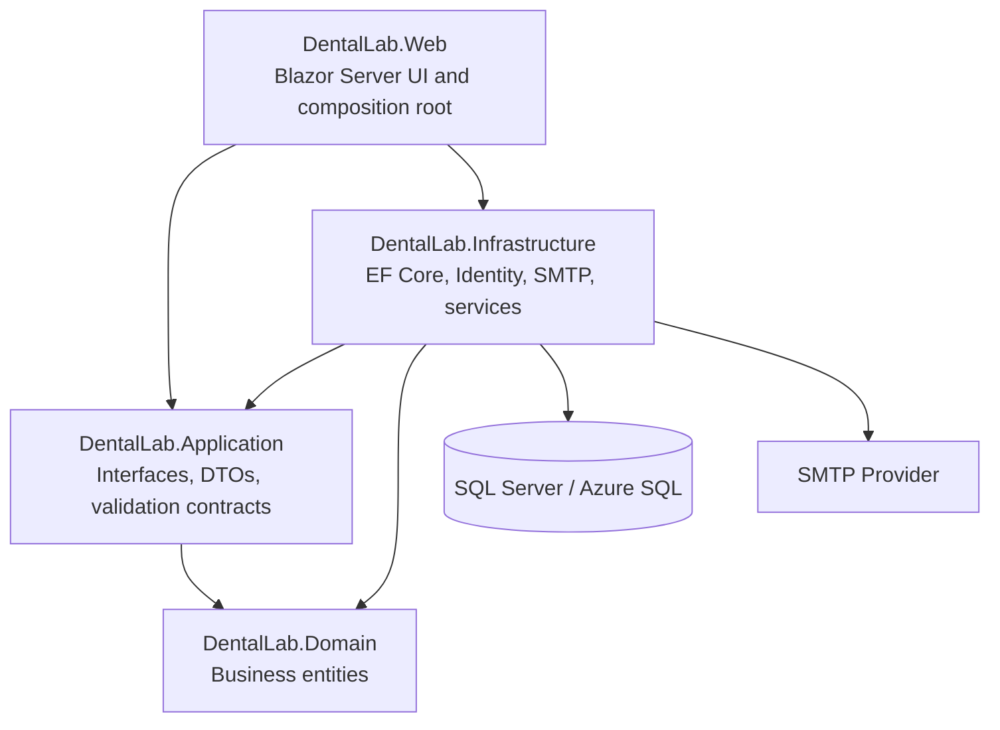
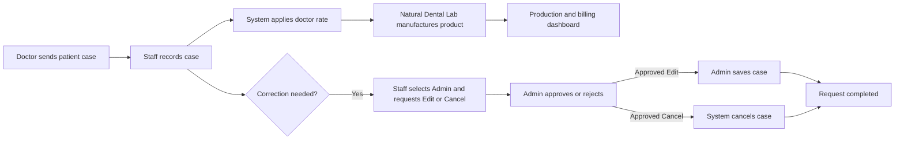

# Natural Dental Lab Operations Platform

> Enterprise-grade dental laboratory operations platform for managing doctor orders, manufacturing records, doctor-specific pricing, case billing, controlled approvals, secure user onboarding, SMTP notifications, and role-based dashboards.


---

## Overview

Natural Dental Lab manufactures patient-specific dental prosthetic products for doctors and dental clinics. Doctors are the commercial customers, patients identify individual clinical cases, and each manufactured product is billed using a doctor-specific rate card.

The platform digitizes the complete laboratory workflow:

1. A doctor sends a patient-specific dental case to Natural Dental Lab.
2. Laboratory staff records the doctor, patient reference, product type, teeth or arch, units, and notes.
3. The system copies the applicable doctor-specific unit rate into each case line.
4. Natural Dental Lab manufactures the requested dental product.
5. The application calculates doctor billing and presents production and revenue metrics.
6. Staff corrections and cancellation requests follow a controlled Admin approval workflow.

> **Important:** This is a dental laboratory production and billing platform, not a clinic appointment or patient-treatment system.

## Key Capabilities

### Doctor and product management

- Active/inactive doctor lifecycle
- Dental product or case-type master data
- Tooth-scope and arch-scope products
- Doctor-specific rate cards
- Individual rate activation and deactivation
- Parent deactivation rules for doctors and case types

### Laboratory case management

- Multi-line case entry under a single Case ID
- Tooth selection using UR, UL, LR, and LL quadrants
- Arch selection for upper or lower arch work
- Automatic unit and amount calculation
- Historical unit-rate snapshot on every case line
- Search, filtering, pagination, details, editing, and cancellation
- Created-by and modified-by audit details
- Optimistic concurrency using SQL `rowversion`

### Controlled approvals

- Staff cannot directly edit or cancel an existing case
- Staff selects an active Admin and submits a reason
- Only one active request per case across Edit and Cancel
- Pending and Approved requests block additional requests
- Approved Edit remains actionable until the Admin saves the case
- Approved Cancellation can be retried if execution fails
- Owner can review and recover any request

### Identity and notifications

- Owner, Admin, and Staff roles
- Secure temporary-password generation
- Forced password change after first login
- Forgot-password and reset-password flow
- SMTP invitation and approval notifications
- Sent/Failed email audit history
- User enable and disable controls
- Bootstrap Owner and role seeding

### Role-based dashboards

- Owner: complete production, billing, approvals, and email-health visibility
- Admin: business production and assigned approval activity
- Staff: personal case-entry and request activity without business-wide financial exposure
- Daily production bar chart
- Case-type production mix
- Doctor-wise monthly billing
- Recent laboratory cases and approval status

## Architecture




### Project responsibilities

```text
DentalLab.Domain
  Business entities and state only

DentalLab.Application
  Interfaces, application models, security constants and contracts

DentalLab.Infrastructure
  EF Core, Identity, SMTP, service implementations and data access

DentalLab.Web
  Blazor pages, middleware, authentication UI and dependency injection
```

Detailed architecture:

- [Enterprise HLD and LLD](docs/architecture/DentalLab_Enterprise_HLD_LLD.docx)
- [Architecture overview](docs/architecture/architecture-overview.md)
- [Architecture decisions](docs/architecture/architecture-decisions.md)
- [Database design](docs/database/database-design.md)
- [Entity relationships](docs/database/entity-relationships.md)

## Roles and Access

| Capability | Owner | Admin | Staff |
|---|:---:|:---:|:---:|
| View business-wide dashboard | Yes | Yes | No |
| Manage doctors, case types, and rates | Yes | Yes | No |
| Create cases | Yes | Yes | Yes |
| Directly edit or cancel cases | Yes | Yes | No |
| Request Edit or Cancellation | Not required | Not required | Yes |
| Review requests | All | Assigned | No |
| Create Admin accounts | Yes | No | No |
| Create Staff accounts | Yes | Yes | No |
| View failed-email warning | Yes | No | No |

Authorization is enforced in both the Razor components and service layer. Hiding a button is never treated as a security boundary.

## Technology Stack

- .NET 10
- Blazor Server with Interactive Server rendering
- ASP.NET Core Identity
- Entity Framework Core 10
- SQL Server or Azure SQL Database
- MailKit SMTP
- Bootstrap and isolated Razor CSS
- Azure App Service deployment model
- User Secrets for local secret management
- App Service settings or Azure Key Vault references for hosted environments

## Repository Structure

```text
natural-dental-lab-platform/
├── .github/
├── database/
├── docs/
│   ├── architecture/
│   ├── database/
│   ├── deployment/
│   ├── images/
│   └── workflows/
├── scripts/
├── src/
│   ├── DentalLab.Domain/
│   ├── DentalLab.Application/
│   ├── DentalLab.Infrastructure/
│   └── DentalLab.Web/
├── tests/
├── .editorconfig
├── .gitattributes
├── .gitignore
├── appsettings.example.json
├── CHANGELOG.md
├── CONTRIBUTING.md
├── LICENSE
├── README.md
├── SECURITY.md
└── DentalLab.sln
```

> If the current solution projects are still at the repository root, keep the working structure initially. Move them under `src/` only in a dedicated refactoring commit after all project references are updated and the solution builds successfully.

## Getting Started

### Prerequisites

- .NET 10 SDK
- Visual Studio with ASP.NET and EF Core tooling, or the .NET CLI
- SQL Server or Azure SQL Database
- SMTP account with an application password or equivalent credential

### 1. Clone the repository

```powershell
git clone https://github.com/<your-account>/natural-dental-lab-platform.git
cd natural-dental-lab-platform
```

### 2. Configure development secrets

Run from the folder containing `DentalLab.Web.csproj`:

```powershell
dotnet user-secrets set "ConnectionStrings:DefaultConnection" "<connection-string>"
dotnet user-secrets set "BootstrapOwner:Email" "owner@example.com"
dotnet user-secrets set "BootstrapOwner:Password" "<strong-initial-password>"

dotnet user-secrets set "Smtp:Host" "smtp.gmail.com"
dotnet user-secrets set "Smtp:Port" "587"
dotnet user-secrets set "Smtp:UserName" "notifications@example.com"
dotnet user-secrets set "Smtp:Password" "<smtp-app-password>"
dotnet user-secrets set "Smtp:FromEmail" "notifications@example.com"
dotnet user-secrets set "Smtp:FromName" "Natural Dental Lab"
dotnet user-secrets set "Smtp:Security" "StartTls"
```

Never commit real passwords, tokens, connection strings, private keys, patient information, or SMTP credentials.

### 3. Restore and build

```powershell
dotnet restore
dotnet build
```

### 4. Apply Identity and email migrations

```powershell
dotnet ef database update `
  --context ApplicationDbContext `
  --project src/DentalLab.Web `
  --startup-project src/DentalLab.Web
```

Adjust the project paths if the projects remain at the repository root.

### 5. Deploy the business schema

Run the versioned scripts in `database/` in dependency order:

1. Doctors and case types
2. Doctor rates
3. Records and `Seq_CaseId`
4. Case approval requests and indexes
5. Views, stored procedures, and reference seed data

See [Database design](docs/database/database-design.md) and [Migration strategy](docs/database/migration-strategy.md).

### 6. Start the application

```powershell
dotnet run --project src/DentalLab.Web
```

On startup:

- `Owner`, `Admin`, and `Staff` roles are created if missing
- The configured Bootstrap Owner is created if missing
- Existing Owner passwords are not overwritten by configuration changes

## Core Workflows



- [Case lifecycle](docs/workflows/case-lifecycle.md)
- [Approval workflow](docs/workflows/approval-workflow.md)
- [Temporary-password flow](docs/workflows/temporary-password-flow.md)
- [Email notifications](docs/workflows/email-notifications.md)

## Database Strategy

The solution intentionally uses two schema ownership models:

### EF Core migrations

- ASP.NET Core Identity tables
- Custom `AspNetUsers` columns
- `EmailNotifications`

### Versioned business SQL

- `Doctors`
- `CaseTypes`
- `DoctorRates`
- `Records`
- `CaseApprovalRequests`
- `Seq_CaseId`
- Views, procedures, and seed data

Production deployments should use reviewed, idempotent migration SQL rather than running ad hoc schema changes.

## Configuration

See [Configuration reference](docs/deployment/configuration-reference.md).

Commit only safe placeholders in `appsettings.json` or `appsettings.example.json`. Use User Secrets locally and hosted environment settings or Key Vault references for deployed environments.

## Testing Checklist

Before merging a release:

- Solution builds with zero errors
- Identity migration applies to a fresh database
- Bootstrap Owner can log in
- Temporary-password invitation is delivered
- User is forced to change the temporary password
- Doctor, case type, and rate lifecycle works
- Tooth and arch unit calculations reconcile
- Staff cannot directly edit or cancel a case
- Only one active request exists per case
- Assigned Admin can approve, reject, and resume approved work
- Approval emails are recorded as Sent or Failed
- Cancelled cases are excluded from production and billing totals
- Owner/Admin/Staff dashboards expose only permitted data
- Dashboard totals reconcile to SQL aggregates

## Security

- Do not commit real `appsettings` secrets
- Do not commit User Secrets
- Do not upload screenshots with real patient names or temporary passwords
- Rotate any credential that has appeared in source control or chat
- Enforce authorization in services, not only in UI components
- Preserve historical case rates for billing integrity
- Keep SMTP failures non-blocking but visible and auditable

## Documentation

| Area | Document |
|---|---|
| Enterprise design | [HLD and LLD](docs/architecture/DentalLab_Enterprise_HLD_LLD.docx) |
| Architecture | [Overview](docs/architecture/architecture-overview.md) |
| Decisions | [Architecture decisions](docs/architecture/architecture-decisions.md) |
| Database | [Database design](docs/database/database-design.md) |
| Migrations | [Migration strategy](docs/database/migration-strategy.md) |
| Relationships | [Entity relationships](docs/database/entity-relationships.md) |
| Local setup | [Local setup](docs/deployment/local-setup.md) |
| Azure deployment | [Azure deployment](docs/deployment/azure-deployment.md) |
| Configuration | [Configuration reference](docs/deployment/configuration-reference.md) |

## Roadmap

- Monthly doctor statement and PDF billing
- Email administration and controlled retry
- Approval SLA and escalation indicators
- Production-stage tracking
- Dispatch and delivery tracking
- External doctor portal
- Invoice and tax module
- Material inventory and stock movements
- Analytics and long-term trend reporting

## Contributing

Use focused branches and conventional commit messages:

```text
feature/monthly-doctor-report
feature/production-status
fix/dashboard-dateonly-filter
fix/approval-concurrency
```

```text
feat: add doctor-specific monthly report
fix: preserve historical unit rate during edit
docs: add enterprise architecture documentation
```

## License

Add the license selected by the repository owner before making the repository public. Until then, treat the source and documentation as proprietary to Natural Dental Lab.
