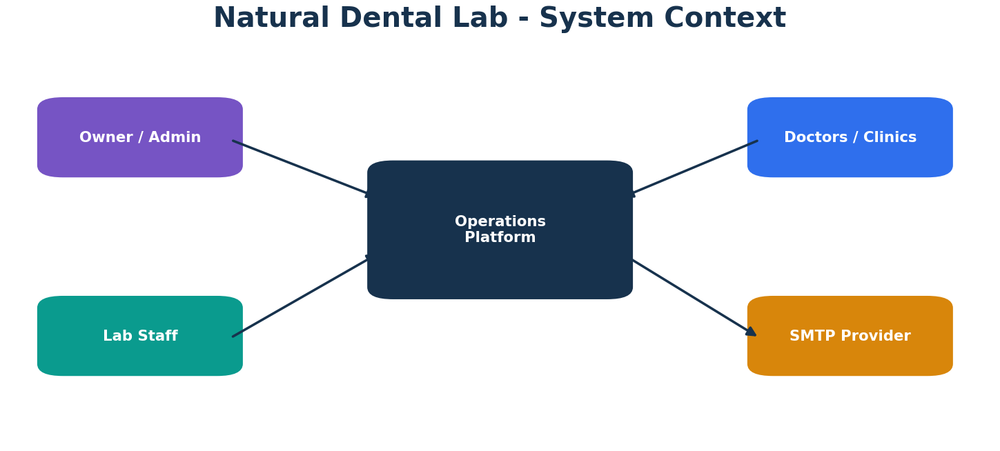
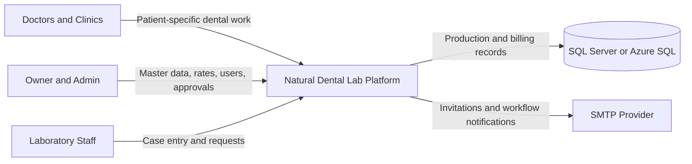
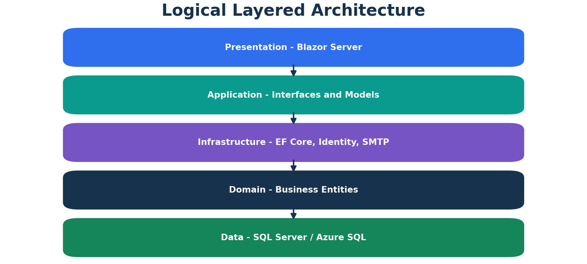
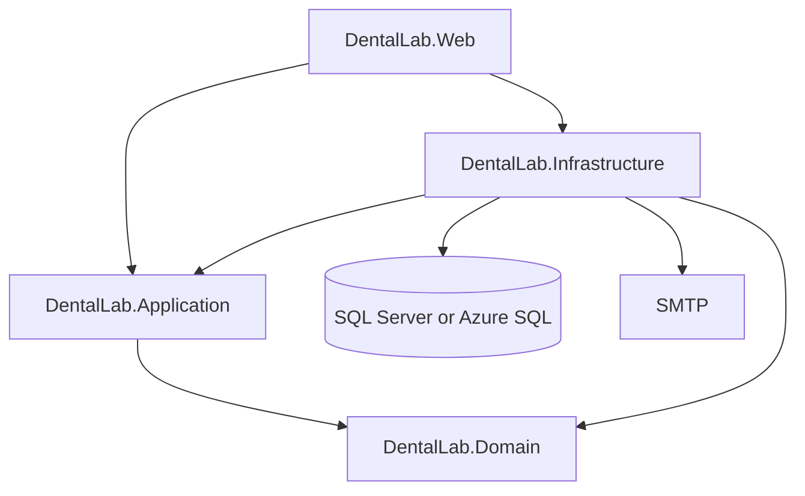
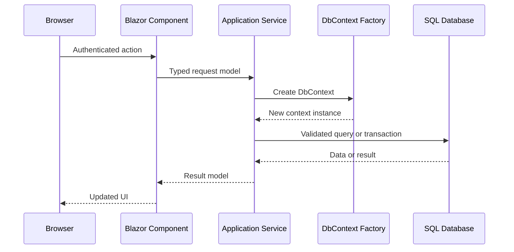

# Architecture Overview

## Purpose

The Natural Dental Lab Operations Platform supports the commercial and operational lifecycle of a dental laboratory that manufactures patient-specific dental prosthetic products for doctors and dental clinics.

The architecture prioritizes:

- clear project boundaries
- secure role-based access
- historical billing integrity
- auditable case corrections and cancellations
- repeatable database deployment
- non-blocking email notifications
- maintainable future expansion

## Context

Doctors are the commercial customers. Patients identify individual laboratory cases but do not authenticate into the current platform.

## Logical Architecture

### DentalLab.Domain

Contains persistent business state and domain entities:

- `Doctor`
- `CaseType`
- `DoctorRate`
- `Record`
- `CaseApprovalRequest`
- `EmailNotification`

The Domain project does not contain UI, SMTP, EF orchestration, or configuration code.

### DentalLab.Application

Contains stable contracts consumed by the Web and Infrastructure layers:

- service interfaces
- request and response models
- case, approval, dashboard, and user DTOs
- role constants
- approval status and request-type constants
- validation attributes

### DentalLab.Infrastructure

Implements external and persistence concerns:

- `ApplicationDbContext`
- entity configurations
- ASP.NET Core Identity custom user model
- Owner and role seeding
- doctor, rate, case, approval, dashboard, and user services
- SMTP transport and email audit
- per-operation `IDbContextFactory` usage

### DentalLab.Web

Provides the interactive internal application:

- Blazor Server pages and components
- role-aware navigation
- account management UI
- temporary-password middleware
- dashboard visualization
- dependency-injection composition root
- authentication endpoints

## Runtime Request Pattern

A new `ApplicationDbContext` is created per service operation. This avoids sharing a non-thread-safe EF Core context across long-lived Blazor circuits.

## Principal Design Rules

1. Business authorization is enforced inside services as well as pages.
2. `Record.UnitRate` is a historical transaction snapshot.
3. Cancelled cases remain available for audit but are excluded from active production and billing.
4. Only one `Pending` or `Approved` request can exist for a case.
5. Email failure never rolls back a valid business transaction.
6. Identity and email schema are managed through EF migrations.
7. Business tables remain managed through versioned SQL scripts or a database project.
8. Secrets are injected through trusted configuration providers and never committed.

## Deployment Topology

The recommended Azure topology consists of:

- Azure App Service hosting the Blazor Server application
- Azure SQL Database
- SMTP provider
- App Service settings or Azure Key Vault references
- HTTPS-only access
- Application Insights as a recommended operational enhancement

## Non-Functional Characteristics

### Security

- ASP.NET Core Identity
- confirmed-account requirement
- Owner/Admin/Staff authorization
- password hashing and tokenized reset flow
- forced initial password change
- server-side validation
- SQL parameterization through EF Core
- rowversion concurrency

### Reliability

- transactional case creation and updates
- retry-capable SQL connection options
- resumable approved workflow actions
- non-blocking SMTP notifications
- migration history and reproducible schema

### Maintainability

- layered projects
- narrow interfaces
- typed DTOs
- isolated entity configuration
- version-controlled documentation
- architecture decision records

## Related Documents

- [Enterprise HLD and LLD](DentalLab_Enterprise_HLD_LLD.docx)
- [Architecture decisions](architecture-decisions.md)
- [Database design](../database/database-design.md)
- [Migration strategy](../database/migration-strategy.md)
- [Local setup](../deployment/local-setup.md)
