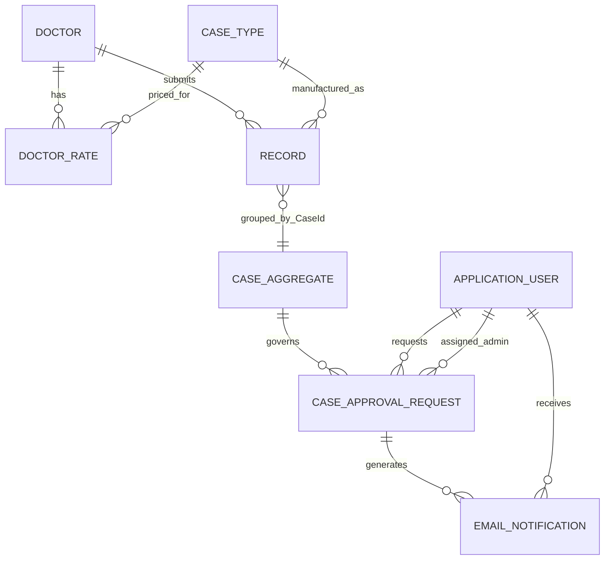

# Entity Relationships

## Relationship Diagram



`CASE_AGGREGATE` is a logical concept represented by multiple `Records` rows sharing the same `CaseId`; it is not necessarily a physical table.

## Doctor to DoctorRate

```text
Doctor (1) -> DoctorRate (many)
```

- `DoctorRate.DocId` references `Doctor.DocId`
- disabling a Doctor disables active rates
- re-enabling the Doctor does not automatically re-enable old rates

## CaseType to DoctorRate

```text
CaseType (1) -> DoctorRate (many)
```

- `DoctorRate.CaseTypeId` references `CaseType.CaseTypeId`
- the composite rate key is `DocId + CaseTypeId`
- the CaseType scope determines tooth or arch behavior

## Doctor to Record

```text
Doctor (1) -> Record (many)
```

Each `Record` line belongs to one Doctor. Multiple lines with the same `CaseId` form one doctor/patient laboratory case.

## CaseType to Record

```text
CaseType (1) -> Record (many)
```

A Record stores the applicable product selection, units, rate snapshot, and amount.

## Logical Case Aggregate

A logical case contains:

- one `CaseId`
- one case date
- one Doctor
- one patient name/reference
- zero or more notes
- one or more line products

Each line contains:

- `LineNumber`
- CaseType
- tooth quadrants or arch
- Units
- UnitRate
- Amount
- RowVersion

## Case to Approval Requests

```text
Logical Case (1) -> CaseApprovalRequest (many over time)
```

Only one request may be active at a time.

Active states:

```text
Pending
Approved
```

Closed states:

```text
Completed
Rejected
Withdrawn
```

A closed request remains for history and does not prevent a future request.

## Identity References

Approval requests store both user ID and email snapshots:

- `RequestedByUserId`
- `RequestedByEmail`
- `AssignedAdminUserId`
- `AssignedAdminEmail`
- reviewer fields
- completion fields

Email snapshots preserve a readable audit trail even if the login email changes later.

## Email Relationships

`EmailNotification` uses:

```text
RelatedEntityType
RelatedEntityId
```

Examples:

```text
RelatedEntityType = User
RelatedEntityId   = <Identity User Id>
```

```text
RelatedEntityType = CaseApprovalRequest
RelatedEntityId   = <Request Id>
```

This avoids hard coupling the email audit table to every possible business entity.

## Delete and Deactivation Guidance

- do not cascade-delete historical Records when Doctor or CaseType is disabled
- do not delete approval history
- do not delete email audit rows required for support
- use logical deactivation for referenced master data
- use controlled data-retention procedures for privacy compliance
