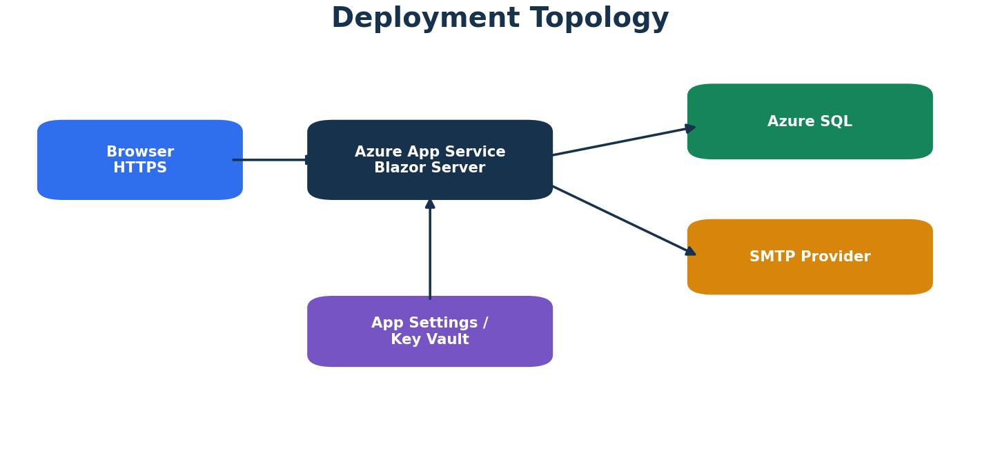

# Azure Deployment

## Recommended Topology



- Azure App Service for the .NET 10 Blazor Server application
- Azure SQL Database
- SMTP provider
- App Service configuration and optional Azure Key Vault references
- Application Insights as a recommended observability service

## Environment Settings

App Service environment-variable mapping uses double underscores:

```text
ConnectionStrings__DefaultConnection
BootstrapOwner__Email
BootstrapOwner__Password
Smtp__Host
Smtp__Port
Smtp__UserName
Smtp__Password
Smtp__FromEmail
Smtp__FromName
Smtp__Security
```

Connection strings may alternatively be stored in the App Service Connection Strings section.

## Secret Protection

Preferred order:

1. Azure Key Vault reference
2. protected App Service setting
3. deployment-time secret variable

Never place production credentials in:

- repository files
- pipeline YAML
- build artifacts
- screenshots
- documentation

## Database Deployment

### Identity and email schema

Generate a reviewed idempotent migration script:

```powershell
dotnet ef migrations script --idempotent `
  --context ApplicationDbContext `
  --project DentalLab.Web `
  --startup-project DentalLab.Web `
  --output Database/Identity/IdentityDeployment.sql
```

### Business schema

Deploy the versioned SQL scripts or database project separately.

### Deployment order

1. backup/restore point
2. Identity/email migration
3. business schema changes
4. application artifact
5. environment configuration
6. application restart
7. smoke tests

## App Service Considerations

- enforce HTTPS Only
- choose Always On where supported
- configure health checks
- use 64-bit process
- ensure the deployment stack supports the targeted .NET runtime
- configure sticky sessions when scaling Blazor Server unless using an appropriate backplane architecture
- restrict database firewall access
- use Managed Identity for Azure resources where supported

SMTP credentials generally remain provider credentials unless the email service supports a managed Azure identity flow.

## Observability

Recommended telemetry:

- request failures
- unhandled exceptions
- authentication failures without passwords
- SQL dependency latency
- failed email count
- Pending and Approved request age
- dashboard query latency

Do not log:

- connection strings
- SMTP passwords
- temporary passwords
- reset tokens
- full patient information

## Smoke Tests

After deployment:

1. Load `/dashboard` as Owner.
2. Verify database connectivity.
3. Verify roles and Bootstrap Owner.
4. Create or reuse a safe test recipient and send an invitation.
5. Verify `EmailNotifications` records Sent or a diagnosable failure.
6. Verify Doctor, CaseType, and Rate read operations.
7. Verify Staff request and Admin review route authorization.
8. Confirm cancelled cases do not contribute to billing.

## Rollback

- retain previous application artifact
- use deployment slots when practical
- prefer forward-fix database migrations
- restore database only under an approved recovery plan
- never roll back application code to a version incompatible with the deployed schema
