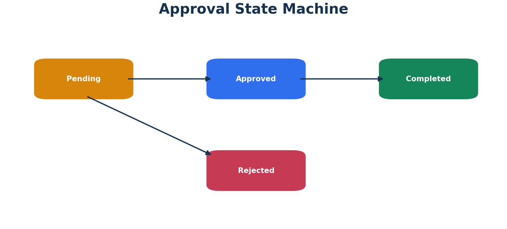
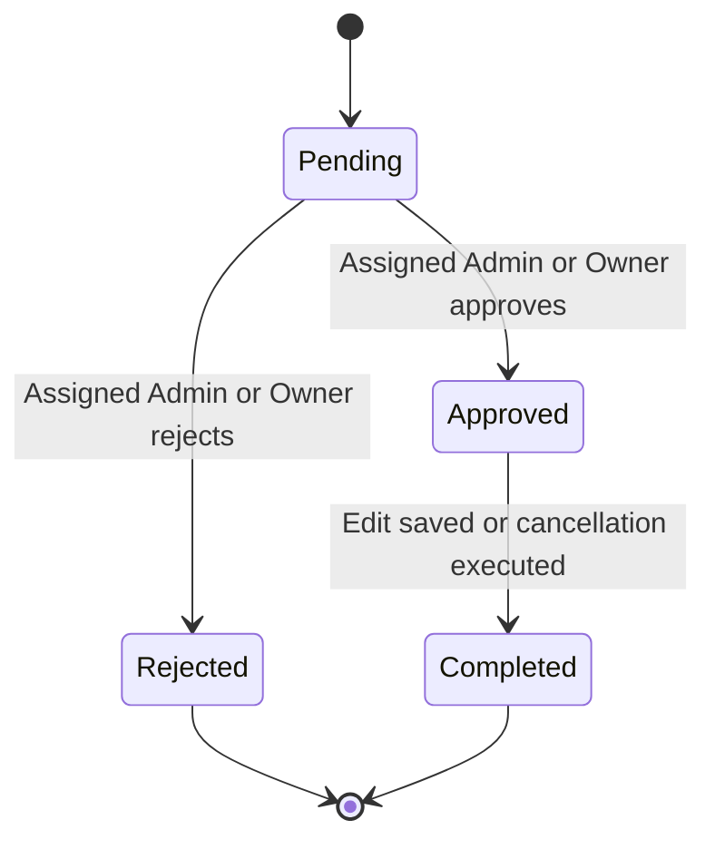

# Edit and Cancellation Approval Workflow

## Objective

Protect case integrity by preventing Staff from directly changing or cancelling an existing laboratory case.

## State Model

`Pending` and `Approved` are active states. Only one active request can exist for a case.

## Submit Request

1. Staff opens Case Details.
2. Staff selects Request Edit or Request Cancellation.
3. Staff selects an active Admin.
4. Staff enters a mandatory reason and optional additional details.
5. Service verifies that the case exists and is not already cancelled.
6. Service rejects the request if any Pending or Approved request exists for the case.
7. Request is saved as Pending.
8. Selected Admin receives an email.

The request email includes:

- Request ID
- Case ID
- request type
- requester email
- assigned Admin email
- reason
- additional details
- request timestamp

## Admin Review

A non-owner Admin can review only a request whose `AssignedAdminUserId` matches the authenticated Admin.

Owner can review any request for governance and recovery.

The review requires:

- mandatory review comment
- matching rowversion
- current status Pending

## Approve Edit

1. Request changes from Pending to Approved.
2. Staff receives an approval email.
3. Admin is redirected to the linked Edit page.
4. Admin reviews and saves the actual case update.
5. Request becomes Completed.
6. Staff receives a completion email.

### Approved but not completed

If the Admin closes the browser before saving:

- request remains Approved
- no new request is allowed for the case
- dashboard shows Awaiting Action
- assigned Admin or Owner can use Continue Approved Edit

## Approve Cancellation

1. Request changes from Pending to Approved.
2. Case cancellation is executed.
3. If successful, request becomes Completed.
4. Staff receives approval and completion notifications.

### Cancellation execution failure

- request remains Approved
- error is returned
- assigned Admin or Owner can use Retry Approved Cancellation
- new requests remain blocked until completion

## Reject

1. Request changes from Pending to Rejected.
2. Reviewer email, timestamp, and comment are saved.
3. Staff receives a rejection email.
4. The request is closed.
5. A new request can be submitted later.

## Concurrency

`CaseApprovalRequest.RowVersion` prevents stale concurrent decisions. When two operations use the same old rowversion, only the first valid save succeeds.

## Email Failure

Email is sent after database state is saved.

If SMTP fails:

- request state remains valid
- `EmailNotifications` records Failed
- error details remain available to Owner/support
- workflow does not roll back
