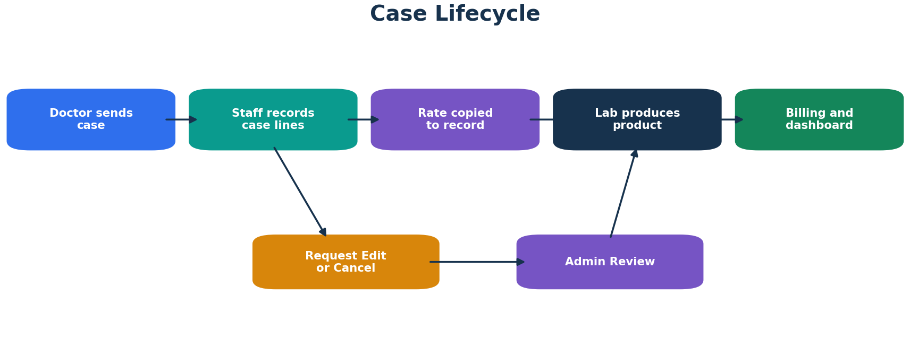
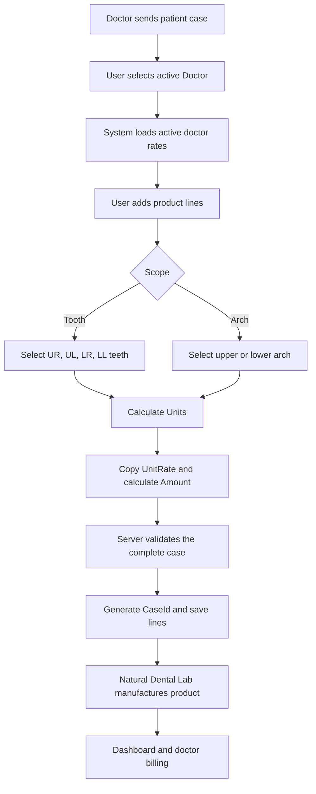

# Case Lifecycle

## Purpose

A case records the patient-specific dental product work sent by a doctor or clinic to Natural Dental Lab.



## Main Flow



## Create Case

### Preconditions

- authenticated Owner, Admin, or Staff
- active Doctor
- active CaseType
- active DoctorRate
- at least one valid line

### Server validations

- doctor exists and is active
- rate exists and is active
- CaseType exists and is active
- scope matches the supplied selection
- tooth lists contain valid, non-duplicated values
- the same tooth is not assigned twice within the case where the business rule disallows it
- units are greater than zero
- unit rate and amount are calculated on the server

### Transaction

1. Obtain the next `CaseId` from `dbo.Seq_CaseId`.
2. Normalize line numbering.
3. Insert every Record line in one transaction.
4. Store `CreatedBy` and UTC `CreatedAt`.
5. Commit only after all lines succeed.

## Unit Calculation

```text
Tooth scope = selected tooth count
Arch scope  = 1
Amount      = UnitRate x Units
```

## Case Details

The detail page displays:

- case header information
- doctor and patient reference
- every product line
- teeth or arch representation
- unit rate, units, and amount
- created and modified audit details
- cancellation status
- role-specific actions

## Edit

### Owner/Admin

Owner or Admin can edit directly.

### Staff

Staff sees:

```text
Request Edit
Request Cancellation
```

Staff cannot access direct mutation routes.

### Concurrency

Every existing line carries a `RowVersion`. If another user modifies the case before save, the service rejects the stale update and asks the user to reload.

## Cancellation

A cancellation:

- preserves all lines
- marks the complete logical case as cancelled
- records cancellation reason
- records the responsible user
- records timestamp
- excludes the case from active units and billing

## Rate Changes

Changing a doctor rate after case creation does not alter the historical case because each Record line stores `UnitRate` and `Amount`.

## Dashboard Impact

Active cases contribute to:

- Cases Today
- Units Today
- Cases This Month
- Units This Month
- Monthly Amount
- doctor-wise billing
- case-type production

Cancelled cases remain visible in recent history but contribute zero to active totals.
