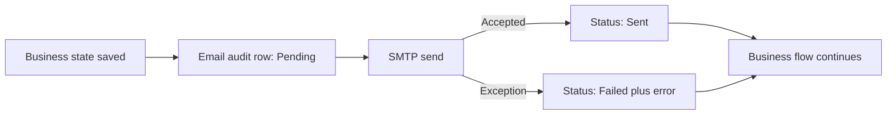

# Email Notifications

## Purpose

Email supports onboarding, password recovery, and approval awareness. Email is not the source of truth; the database workflow state remains authoritative.

## Transport

The current implementation uses MailKit SMTP.

Supported security modes:

```text
StartTls
SslOnConnect
None
```

Use `StartTls` with port 587 when supported by the provider. Do not use `None` outside a trusted, controlled test environment.

## Notification Types

| Notification Type | Recipient | Trigger |
|---|---|---|
| `UserInvitation` | New user | Owner/Admin creates or resends invitation |
| `PasswordReset` | Existing user | Forgot Password request |
| `EmailConfirmation` | User | Confirmation flow, if used |
| `CaseApprovalRequested` | Selected Admin | Staff submits Edit/Cancel request |
| `CaseApprovalApproved` | Requesting Staff | Admin approves request |
| `CaseApprovalRejected` | Requesting Staff | Admin rejects request |
| `CaseEditCompleted` | Requesting Staff | Approved Edit is saved |
| `CaseCancellationCompleted` | Requesting Staff | Approved cancellation completes |

## Audit Model

Every attempt creates an `EmailNotifications` row containing:

- recipient
- subject
- notification type
- related entity type and ID
- Pending/Sent/Failed status
- attempt count
- error message
- created and sent timestamps

## Delivery Pattern



Email failure never rolls back a valid case, request, decision, cancellation, or user record.

## SMTP Configuration

```json
{
  "Smtp": {
    "Host": "",
    "Port": 587,
    "UserName": "",
    "Password": "",
    "FromEmail": "",
    "FromName": "Natural Dental Lab",
    "Security": "StartTls"
  }
}
```

Real values are supplied through User Secrets, App Service settings, or Key Vault references.

## Gmail Guidance

When Gmail is used:

- enable two-step verification
- create an application password
- do not use the normal mailbox password
- configure `smtp.gmail.com`, port 587, and `StartTls`
- keep `FromEmail` aligned with the authenticated sender unless the account is authorized for another address

## TLS Certificate Revocation

If a development network cannot reach the certificate revocation endpoint, MailKit can fail before authentication.

Preferred resolution:

1. restore network access to revocation endpoints
2. update machine certificate stores and proxy policy
3. only for local development, disable revocation checking through environment-specific configuration

Do not configure a callback that trusts every certificate in production.

## Monitoring Query

```sql
SELECT TOP (50)
    EmailNotificationId,
    RecipientEmail,
    NotificationType,
    RelatedEntityType,
    RelatedEntityId,
    Status,
    AttemptCount,
    ErrorMessage,
    CreatedOn,
    SentOn
FROM dbo.EmailNotifications
ORDER BY EmailNotificationId DESC;
```

## Recommended Retry Policy

A future administration page should:

- allow Owner to filter failed notifications
- show sanitized error details
- retry only safe, idempotent notification types
- create a new attempt row rather than rewriting history
- avoid resending temporary passwords without generating a new password
