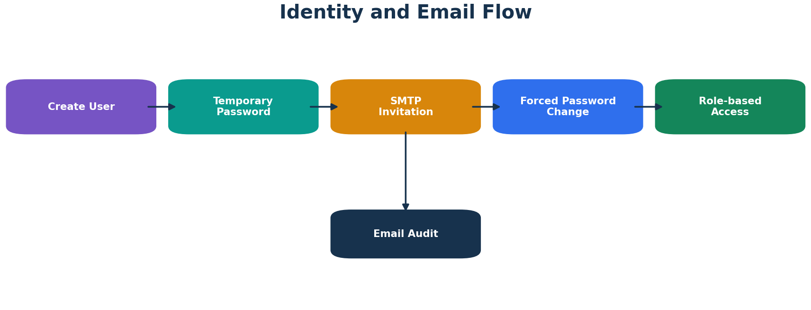
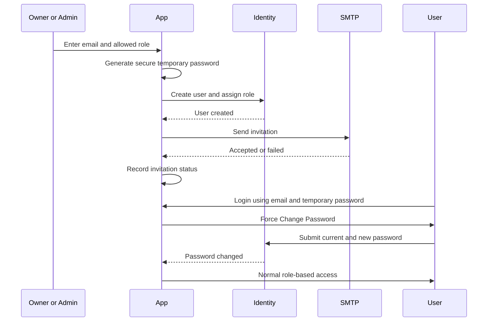

# Temporary Password and User Onboarding

## Purpose

Allow Owner and Admin users to create accounts without manually choosing or retaining another user's password.



## Role Rules

- Owner can create Admin and Staff
- Admin can create Staff
- Staff cannot create users
- a user cannot disable the same account currently in use

## Create User Flow



## Identity Fields

```text
MustChangePassword
TemporaryPasswordIssuedOn
PasswordChangedOn
InvitationEmailStatus
InvitationEmailSentOn
InvitationEmailError
```

## Password Security

- temporary password is generated using a cryptographically secure random source
- temporary password is never persisted in plaintext
- Identity stores only the password hash
- temporary password appears only in the invitation email composition
- clicking Resend generates a new password and invalidates the old one
- password values must never appear in logs

## Forced Change

`TemporaryPasswordMiddleware` checks authenticated users.

When `MustChangePassword` is true, only required paths are allowed:

- Change Password
- Logout
- framework/system paths
- required static assets

All business routes redirect to Change Password.

After successful change:

```text
MustChangePassword = false
TemporaryPasswordIssuedOn = null
PasswordChangedOn = current UTC time
```

The sign-in session is refreshed.

## Invitation Status

```text
Pending -> send attempt started
Sent    -> SMTP server accepted the message
Failed  -> error recorded
```

SMTP acceptance does not guarantee inbox placement; provider delivery, spam filtering, and recipient policy remain external.

## Resend

Resend performs a password reset using an Identity reset token, assigns a new temporary password, marks the account as requiring password change, and sends a new invitation.

## Forgot Password

1. User submits email.
2. The application returns the same confirmation response whether or not the user exists.
3. For a valid confirmed account, Identity generates a reset token.
4. SMTP sends the reset link.
5. User chooses a new password.
6. Temporary-password flags are cleared.

## Bootstrap Owner

`IdentitySeeder` creates roles and creates the Owner only when the configured email does not already exist.

The configured bootstrap password is not reapplied after the Owner exists. Normal password changes occur in the UI; forgotten passwords use the reset flow.
